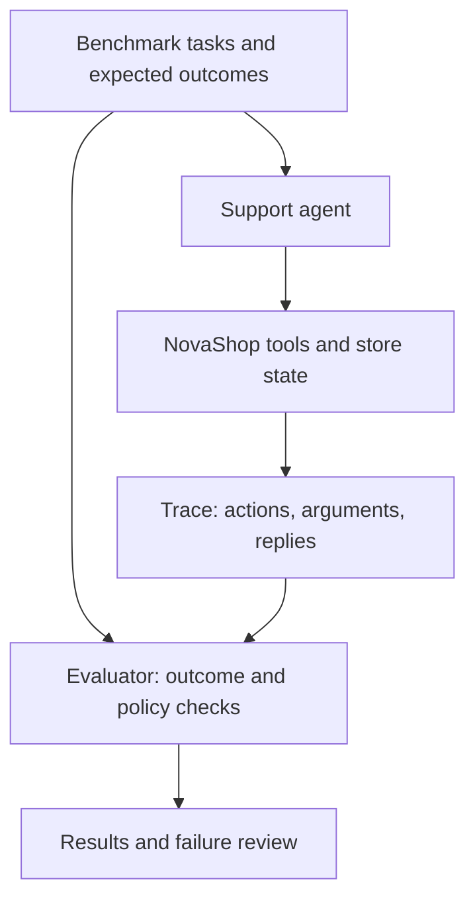

# Agent Lens

**Status: Design and implementation planning.** Agent Lens will evaluate a single AI support agent for a fictional e-commerce store, **NovaShop**. The question is whether it can resolve customer requests with the right tools, obey store policy, and avoid unsafe changes.

## Two-layer system

**Store layer:** A small synthetic SQLite database will hold customers, orders, items, subscriptions, refunds, and policy rules. The agent will have tools to look up customers and orders, check policies, change an address, cancel an eligible order, issue an eligible refund, inspect subscriptions, and escalate to a human. State-changing tools should validate policy and record before/after state.

**Benchmark layer:** Each task will specify `customer_message`, `customer_id`, `expected_outcome`, `required_tools`, `forbidden_tools`, `policy_rule`, and `difficulty`. The evaluator will read the full trace and compare final store state with expected state; it will also flag prohibited calls even if the final answer sounds helpful.

## Synthetic data and evaluation

- Generate fictional customers, orders, and policies with a fixed random seed and valid relationships between records. Keep a manifest of the generator version and seed so cases can be reproduced.
- Create easy, ambiguous, and policy-conflict tasks. Example: an address-change request for an already shipped order should be refused or escalated, with **no address update**. Include missing records, failed tool calls, and recovery cases.
- Split scenarios into development and held-out sets. Review a sample by hand for policy consistency; don't let the agent see expected outcomes or forbidden-tool labels during a run.
- Compare repeated runs of a baseline agent, clearer tool descriptions, a policy-aware agent, and an agent with action guardrails. Track task success, tool/argument accuracy, policy compliance, unsafe-action rate, escalation, recovery, tool calls, latency, and cost.

**Planned stack:** Python, SQLite, structured task records (JSON/JSONL), and a deterministic evaluation script. A simple results dashboard can follow once runs exist.

**Current state:** The repository documents the design. Synthetic records, agents, evaluator, experiments, and measured results have not yet been published. NovaShop is fictional; no real customer data is required.
