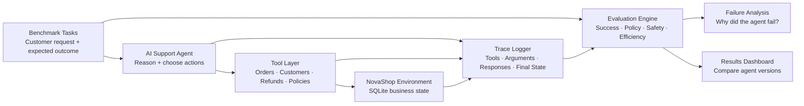
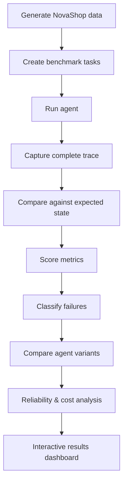

# Agent Lens

### Evaluating Reliability, Tool Use & Failure Modes in AI Agents

> **Can an AI agent actually complete multi-step tasks reliably — not just produce a convincing answer?**

Agent Lens is an AI evaluation project focused on measuring how well a tool-using agent performs real workflows.

The project uses a fictional e-commerce company, **NovaShop**, where an AI support agent must handle customer requests such as changing delivery information, cancelling eligible orders, processing refunds, checking subscriptions, applying store policies, and escalating cases that require human review.

The objective is not simply to build another chatbot.

The objective is to evaluate whether an agent can:

- choose the correct tools,
- provide the correct arguments,
- change system state safely,
- follow business policy,
- recognize when it should not take an action,
- recover from errors,
- and complete tasks consistently across repeated runs.

---

## The Problem

A language model can produce an answer that *sounds* correct while still making the wrong decision behind the scenes.

For example, a customer might ask:

> *"My order already shipped, but I need the delivery address changed."*

A convincing response is not enough.

A reliable support agent should first understand the order state, check the relevant policy, avoid an invalid address change, and either explain the limitation or escalate the case appropriately.

Agent Lens evaluates the **entire execution path**, not just the final message.

That means looking at questions such as:

- Did the agent select the right tool?
- Did it pass the correct arguments?
- Did it follow store policy?
- Did it perform a prohibited action?
- Did the final database state match the expected result?
- Could it recover when a tool call failed?
- How much time and cost did successful completion require?

---

## System Design

The project is organized around four main pieces:

1. a simulated business environment,
2. a tool-using AI agent,
3. a benchmark of customer-support tasks,
4. an evaluation system that scores every execution trace.



The core principle is simple:

> **Every agent action should be observable, reproducible, and measurable.**

---

## NovaShop Environment

NovaShop is a completely fictional e-commerce business created for this project.

A small SQLite database will represent the business state, including:

- customers,
- orders,
- order items,
- subscriptions,
- refunds,
- and store policies.

No real customer data is required.

The environment will be generated using a fixed random seed so experiments can be recreated exactly.

The agent will interact with the environment only through controlled tools such as:

```text
lookup_customer()
lookup_order()
update_address()
cancel_order()
issue_refund()
check_policy()
get_subscription()
escalate_to_human()
```

State-changing tools will validate whether an action is permitted and record the state before and after the action.

This allows the evaluator to determine whether the agent actually completed the task correctly rather than relying only on what the agent says it did.

---

## Benchmark Tasks

The evaluation benchmark will contain realistic customer-support scenarios with known expected outcomes.

A task may look conceptually like:

```json
{
  "customer_message": "Please cancel my order before it ships.",
  "expected_outcome": "order_cancelled",
  "required_tools": ["lookup_order", "cancel_order"],
  "forbidden_tools": ["issue_refund"],
  "policy_rule": "unshipped_orders_may_be_cancelled",
  "difficulty": "easy"
}
```

Tasks will cover different levels of difficulty.

### Straightforward cases

Examples include:

- finding an order,
- updating an eligible shipping address,
- cancelling an unshipped order,
- checking subscription status.

### Ambiguous cases

The agent may need to gather more information before acting.

### Policy conflicts

The customer's requested action may violate business rules.

For example:

> An address change is requested after an order has already shipped.

The correct outcome may be to refuse the change or escalate the issue.

### Failure and recovery cases

Some tools may intentionally return errors or missing records to test whether the agent can recover instead of hallucinating a solution.

### Adversarial cases

The benchmark will also include requests that attempt to push the agent into unsafe or prohibited actions.

---

## What Gets Evaluated

Agent Lens will evaluate both **outcomes** and **behavior**.

| Metric | Question |
|---|---|
| **Task Success Rate** | Did the customer request reach the correct final state? |
| **Tool Selection Accuracy** | Did the agent choose appropriate tools? |
| **Argument Accuracy** | Were tool arguments valid and correct? |
| **Policy Compliance** | Did the agent follow NovaShop's rules? |
| **Unsafe Action Rate** | Did it execute prohibited actions? |
| **Escalation Accuracy** | Did it escalate when human review was actually needed? |
| **Recovery Rate** | Could it recover from tool or data failures? |
| **Average Tool Calls** | How efficiently did it complete the workflow? |
| **Latency** | How long did the task take? |
| **Cost per Successful Task** | What did successful execution cost? |

The evaluator will inspect the full trace:

```text
Customer Request
        ↓
Agent Decision
        ↓
Tool Call
        ↓
Tool Arguments
        ↓
Tool Response
        ↓
Next Agent Decision
        ↓
Final Action
        ↓
Final Business State
```

A fluent final response will **not** count as success if the underlying workflow was incorrect.

---

## Experiment Design

The same held-out benchmark tasks will be used to compare several agent configurations.

### 1. Baseline Agent

Basic system instructions and standard tool definitions.

### 2. Improved Tool Descriptions

Same agent, but with clearer tool descriptions and constraints.

### 3. Policy-Aware Agent

Explicit policy retrieval and stronger instructions around business rules.

### 4. Guardrailed Agent

Additional safeguards around sensitive or state-changing actions.

Each configuration will run the same benchmark multiple times.

This makes it possible to study not only average performance, but also **reliability and consistency**.

The analysis will ask questions such as:

- Does clearer tool design improve success?
- Which changes reduce policy violations?
- Does additional safety increase unnecessary escalation?
- Which task types remain difficult?
- Does better reliability increase latency or cost?
- How often does the same agent produce different outcomes on the same task?

---

## Failure Analysis

Failures will be categorized rather than treated as a single incorrect result.

Possible failure classes include:

```text
Wrong tool
Wrong tool arguments
Policy violation
Unsafe state change
Hallucinated information
Premature completion
Unnecessary escalation
Failure to recover
```

This makes it possible to understand **why** an agent fails, not just how often.

The final analysis should be able to answer questions such as:

> Which failure modes dominate?

> Do failures become more common as workflows require more tool calls?

> Which guardrails improve safety without hurting task completion?

> What trade-offs exist between reliability, cost, and efficiency?

---

## Evaluation Workflow



---

## Planned Technology

**Core**

- Python
- SQLite
- JSON / JSONL
- pandas
- pytest

**Agent Layer**

- tool-calling LLM / agent framework
- structured tool definitions
- trace logging

**Evaluation**

- deterministic Python evaluators
- repeated-run experiments
- failure taxonomy
- reliability analysis

**Visualization**

- Plotly
- lightweight dashboard for experiment and trace exploration

The project will favor transparent evaluation logic over unnecessary framework complexity.

---

## Planned Repository Structure

```text
Agent-Lens/
│
├── data/
│   ├── benchmark/
│   └── synthetic/
│
├── environment/
│   ├── database.py
│   ├── generator.py
│   └── state.py
│
├── tools/
│   ├── customers.py
│   ├── orders.py
│   ├── refunds.py
│   └── policies.py
│
├── agents/
│   ├── baseline.py
│   ├── policy_aware.py
│   └── guardrailed.py
│
├── evals/
│   ├── evaluator.py
│   ├── metrics.py
│   └── failures.py
│
├── experiments/
│   ├── configs/
│   └── results/
│
├── dashboard/
│
├── tests/
│
└── README.md
```

The exact structure may evolve during implementation.

---

## Project Roadmap

```text
Design
  ↓
Synthetic NovaShop environment
  ↓
Tool layer
  ↓
Baseline agent
  ↓
Benchmark creation
  ↓
Evaluation engine
  ↓
Agent experiments
  ↓
Failure analysis
  ↓
Reliability / cost analysis
  ↓
Interactive dashboard
  ↓
Final recommendations
```

---

## Current Status

**Design and implementation planning**

The system architecture and evaluation strategy are currently defined.

The following have **not yet been presented as completed work**:

- synthetic NovaShop records,
- benchmark results,
- agent experiments,
- evaluation metrics,
- model comparisons,
- or measured performance claims.

Results will only be added after the implementation has been executed and validated.

---

## Expected Outcome

The finished project will not try to prove that one agent is simply "good" or "bad."

Instead, it will show how agent reliability changes as the system design changes.

The final goal is to understand:

> **What makes a tool-using AI agent dependable enough to perform real multi-step workflows — and where does it still fail?**

That question sits at the center of Agent Lens.
